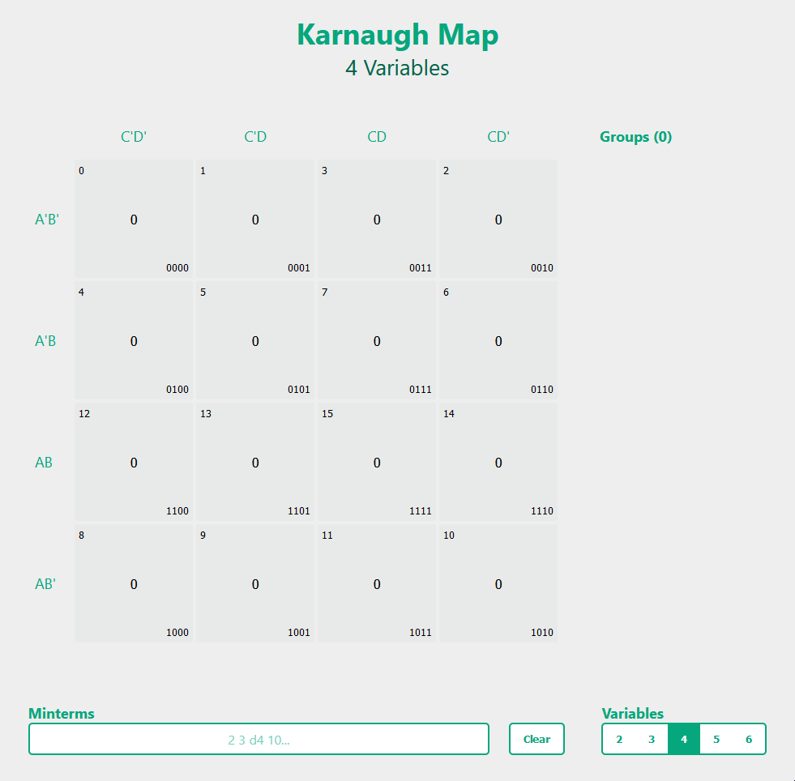

## Karnaugh Maps Revisited

### Quick Introduction

A K-Map visualizer and solver. 

This is a remake of one of my very first projects that originally just served as a visual tool.

Minterms can be inputted through clicking on the tiles, or inputting the decimal values into the bottom bar. When clicking, the tile will cycle between `false -> true -> don't-care`.
For input, the decimal values are space-separated, and don't-cares are preceeded with a `d`.

```
0 1 2 d3 d4 7 8 d15
```

### Goal of the Project

I made this tool because it was very difficult to find k-map solvers online that didn't have
tacky inputs and page loads when simplifying the terms.

This tool solves the k-map on every change so that it feels more seamless, and makes
it easier to experiment around with different minterms.

